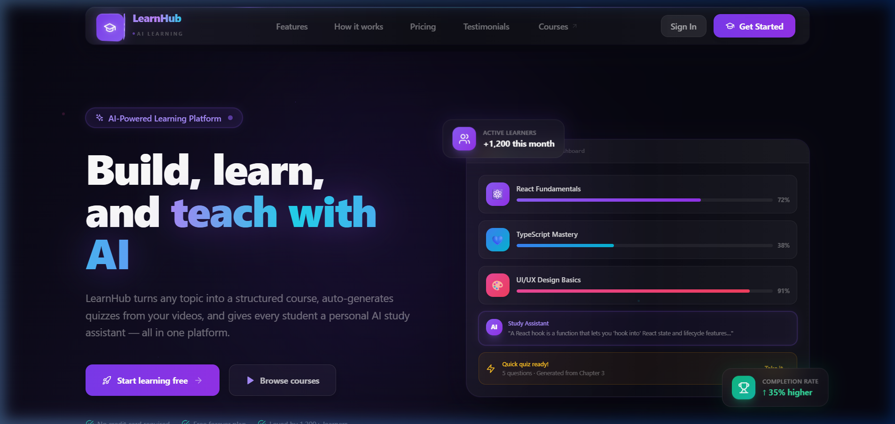
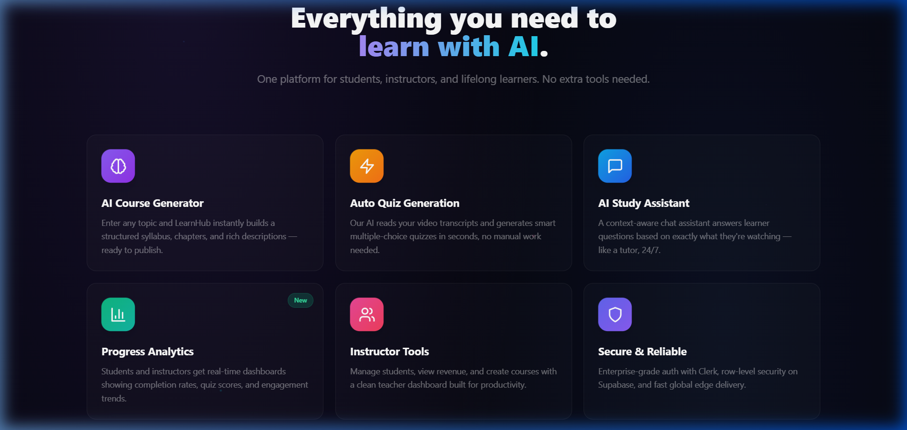
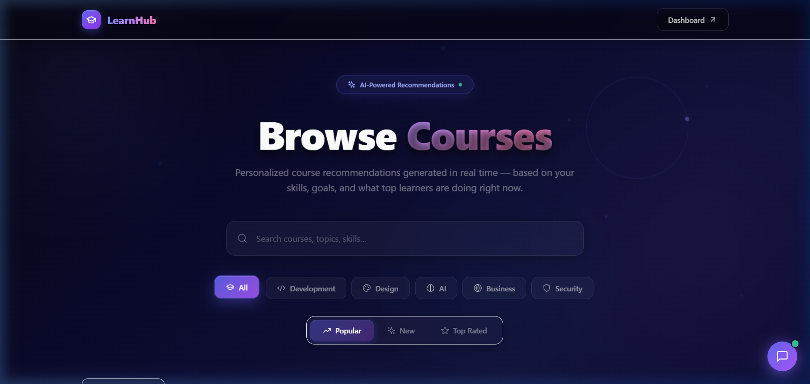
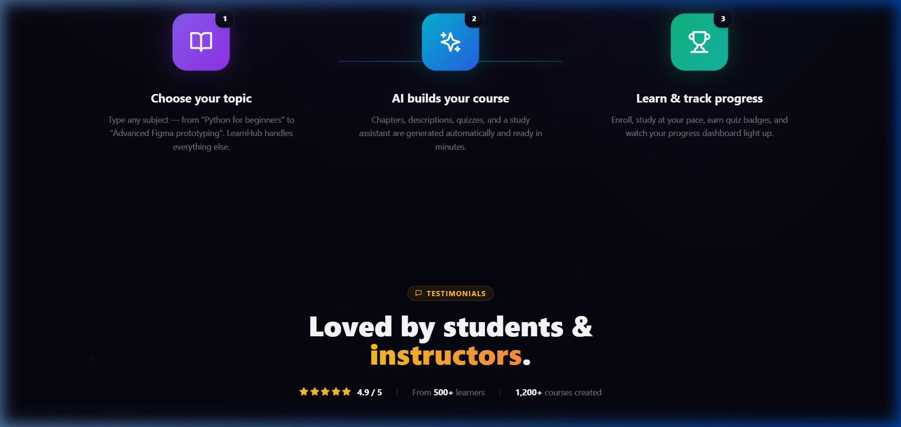
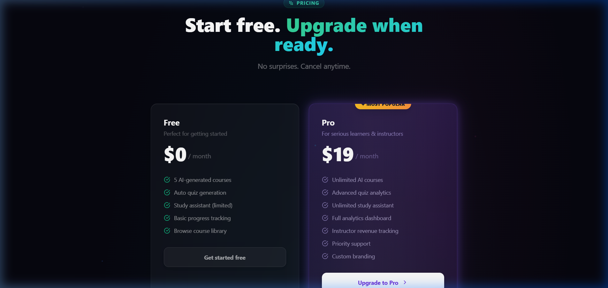
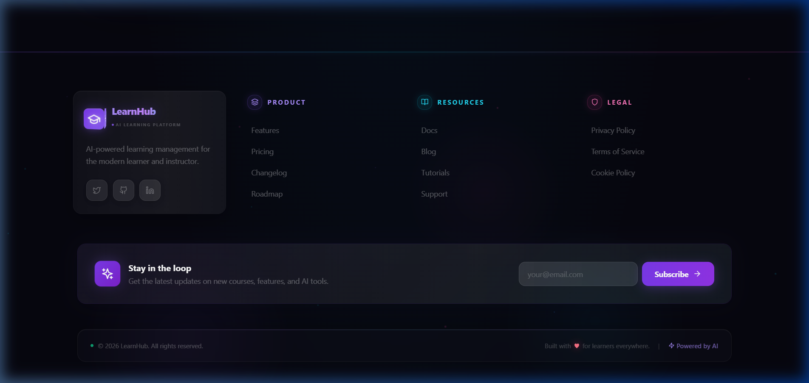

<p align="center">
  
</p>

<h1 align="center">🎓 LearnHub — AI-Powered Learning Management System</h1>

<p align="center">
  <strong>A next-generation LMS with immersive 3D UI, AI course generation, auto quizzes, and a personal study assistant.</strong>
</p>

<p align="center">
  <a href="#features"></a>
  <a href="#tech-stack"></a>
  <a href="#tech-stack"></a>
  <a href="#tech-stack"></a>
  <a href="#tech-stack"></a>
  <a href="#tech-stack"></a>
</p>

---

## ✨ Overview

LearnHub is a comprehensive AI-powered learning platform that transforms any topic into a structured course, auto-generates quizzes from video transcripts, and gives every student a personal AI study assistant — all wrapped in an **immersive 3D glassmorphic interface** with holographic effects, floating particles, and mouse-tracking interactions.

---

## 📸 Screenshots

### 🏠 Homepage — 3D Hero Section
The landing page features a cinematic 3D hero with floating stat cards, parallax depth effects, and a rotating 3D cube logo. The glassmorphic navbar supports holographic shimmer, animated gradient borders, and neon-underline hover effects.


### 🚀 Features — Holographic 3D Cards
Six feature cards with 3D perspective transforms, hover glow effects, and holographic scanlines showcase the platform's AI capabilities.



### 📚 Browse Courses — Immersive 3D Experience
Mouse-tracking tilt cards, staggered 3D entry animations, holographic borders, and a perspective grid floor create a truly immersive course browsing experience.



### 🛤️ How It Works — 3D Timeline
A three-step visual timeline with depth-breathing icons, orbiting rings, and connected gradient lines guides users through the platform.



### 💎 Pricing — Holographic Pro Card
The pricing section features glassmorphic cards with the Pro tier highlighted by holographic scanlines, animated shimmer, and a direct Stripe payment integration.



### 🌐 Footer — 3D Holographic Design
The footer includes a perspective grid floor, floating glow orbs, a glassmorphic brand card with a rotating 3D cube logo, color-coded section headers, and a newsletter subscription CTA.



---

## 🎯 Features

| Feature | Description |
|---------|-------------|
| 🧠 **AI Course Generator** | Enter any topic → LearnHub instantly creates a full syllabus with chapters, descriptions, and video structure |
| ⚡ **Auto Quiz Generation** | AI reads video transcripts and generates smart multiple-choice quizzes automatically |
| 💬 **AI Study Assistant** | Context-aware chatbot that answers questions based on exactly what the student is watching |
| 📊 **Progress Analytics** | Real-time dashboards for students and instructors with completion rates, quiz scores, and trends |
| 👨‍🏫 **Instructor Tools** | Manage students, view revenue, create courses with a clean teacher dashboard |
| 🎯 **Skill Assessment Quiz** | Onboarding quiz that evaluates students and recommends personalized learning paths |
| 🔐 **Role-Based Access** | Separate portals for Students, Teachers, and Admins with Clerk authentication |
| 💳 **Stripe Payments** | Pro subscription ($19/month) and paid course checkout with Stripe |

---

## 🎨 3D Design System

LearnHub uses a custom **immersive 3D design system** built entirely with CSS transforms and hardware-accelerated animations:

- **🎲 3D Rotating Cube Logo** — CSS-only 3D cube with 6 faces, idle animation & hover spin
- **🌈 Animated Gradient Borders** — Continuously shifting gradient borders using CSS masks
- **✨ Holographic Shimmer** — Diagonal light sweep effects across glassmorphic surfaces
- **🪟 Glassmorphism** — Backdrop blur, subtle borders, and translucent backgrounds
- **📐 Perspective Grid** — 3D vanishing-point grids creating spatial depth
- **💫 Floating Particles** — Animated particles at varying speeds and colors
- **🎯 Mouse-Tracking Tilt** — Cards respond to cursor position with perspective rotateX/Y transforms
- **📦 Staggered Entry** — Elements animate in with perspective transforms and delays
- **🔮 Neon Glow Effects** — Accent-colored shadows that intensify on hover
- **🌊 Holographic Scanlines** — Animated scanlines that sweep across cards

---

## 🛠️ Tech Stack

| Layer | Technology |
|-------|------------|
| **Framework** | Next.js 14 (App Router) |
| **Language** | JavaScript (JSX) |
| **Auth** | Clerk (role-based: Teacher/Student/Admin) |
| **Database** | Supabase (PostgreSQL, RLS, Storage) |
| **Payments** | Stripe (subscriptions & one-time payments) |
| **Video** | Mux (HLS streaming, direct uploads) |
| **AI** | OpenAI API (GPT-4) |
| **Styling** | Tailwind CSS + Custom 3D CSS System |
| **UI Components** | Shadcn/ui (Radix primitives) |

---

## 🚀 Getting Started

### Prerequisites

- Node.js 18+
- npm or yarn
- Supabase account
- Clerk account
- OpenAI API key
- Stripe account (optional, for payments)

### 1. Clone & Install

```bash
git clone https://github.com/your-username/learnhub.git
cd learnhub
npm install
```

### 2. Environment Variables

Create a `.env` file in the root directory:

```env
# Clerk Authentication
NEXT_PUBLIC_CLERK_PUBLISHABLE_KEY=pk_test_...
CLERK_SECRET_KEY=sk_test_...
NEXT_PUBLIC_CLERK_SIGN_IN_URL=/sign-in
NEXT_PUBLIC_CLERK_SIGN_UP_URL=/sign-up

# Supabase
NEXT_PUBLIC_SUPABASE_URL=https://your-project.supabase.co
NEXT_PUBLIC_SUPABASE_ANON_KEY=eyJ...
SUPABASE_SERVICE_ROLE_KEY=eyJ...

# Database (for migrations)
DATABASE_URL=postgresql://...
DIRECT_URL=postgresql://...

# OpenAI (for AI features)
OPENAI_API_KEY=sk-...

# Stripe (for payments)
STRIPE_SECRET_KEY=sk_test_...
STRIPE_WEBHOOK_SECRET=whsec_...
STRIPE_PRO_PRICE_ID=price_...   # Optional: Stripe Price ID for Pro plan

# Mux (for video hosting)
MUX_TOKEN_ID=...
MUX_TOKEN_SECRET=...

# Clerk Webhook (optional, for profile sync)
CLERK_WEBHOOK_SECRET=...
```

### 3. Database Setup

1. Create a Supabase project
2. Run the migration in the SQL editor: `supabase/migrations/001_initial_schema.sql`
3. Enable Storage for course thumbnails if needed

### 4. Run Development Server

```bash
npm run dev
```

Visit **[http://localhost:3000](http://localhost:3000)**

---

## 📁 Project Structure

```
src/
├── app/
│   ├── (auth)/              # Sign-in, Sign-up pages
│   ├── api/
│   │   ├── ai/              # AI endpoints (course gen, quiz, study assistant)
│   │   ├── stripe/           # Stripe checkout & subscription
│   │   ├── enroll/           # Course enrollment & confirmation
│   │   └── webhooks/         # Clerk webhooks
│   ├── dashboard/           # Role-based dashboards
│   ├── courses/             # Browse courses (3D UI)
│   ├── learn/[slug]/        # Learning experience (video player, sidebar)
│   ├── student/             # Student portal
│   ├── teacher/             # Teacher portal (course management)
│   ├── college/             # College portal
│   ├── onboarding/          # Role selection & skill quiz
│   └── page.jsx             # Landing page (3D hero, features, pricing)
├── components/
│   ├── ui/                  # Shadcn-style UI primitives
│   ├── course/              # Course cards, editor, enroll button
│   ├── dashboard/           # Dashboard widgets
│   └── learn/               # Video player, quiz, AI assistant
├── lib/
│   ├── supabase/            # Database clients (client, server, admin)
│   └── utils.js             # Utility functions
└── docs/
    └── screenshots/         # README images
```

---

## 🎬 Key Flows

### Student Journey
1. **Sign Up** → Role selection → Skill assessment quiz
2. **Dashboard** → View enrolled courses, progress, recommendations
3. **Browse Courses** → Search, filter, enroll (free or paid via Stripe)
4. **Learn** → Video player, chapter progress, per-chapter Q&A
5. **AI Study Assistant** → Ask questions based on current video context
6. **Quizzes** → Auto-generated from video transcripts, earn badges

### Teacher Journey
1. **Sign Up** → Select Teacher role
2. **Create Course** → Manual or AI-generated (topic → full syllabus)
3. **Add Chapters** → Upload videos (Mux), add descriptions
4. **Publish** → Set price, publish course
5. **Analytics** → View students, revenue, completion rates

---

## 💳 Payment Integration

LearnHub uses **Stripe** for payments:

- **Pro Subscription** ($19/month) — Click "Upgrade to Pro" → Stripe Checkout → Recurring billing
- **Paid Courses** — Individual course purchases via Stripe Checkout
- **Webhooks** — Automatic enrollment confirmation after successful payment

---

## 🎥 Video Hosting (Mux)

For full Mux integration:

1. Create a Mux account and get API credentials
2. Use the Direct Upload flow for client-side video uploads
3. Videos stream via HLS: `https://stream.mux.com/{playbackId}.m3u8`
4. Store `mux_playback_id` in the chapter record

---

## 📄 License

This project is for educational purposes. See [LICENSE](LICENSE) for details.

---

<p align="center">
  Built with ❤️ for learners everywhere<br/>
  <strong>⚡ Powered by Abhigyan</strong>
</p>
